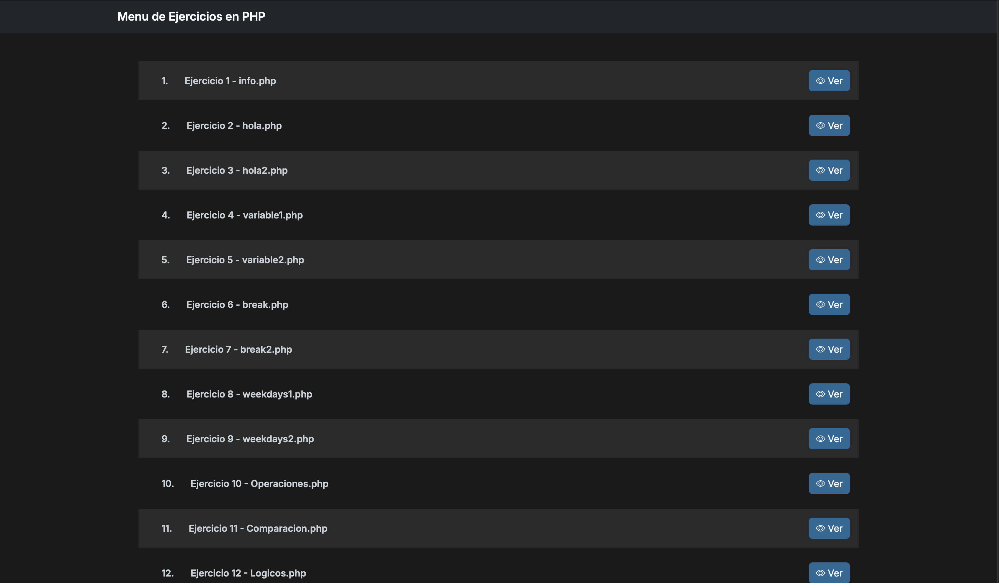

# Menú de ejercicios en PHP

Tarea universitaria que presenta un menú de ejercicios de programación. Cada opción del menú corresponde a un ejercicio con su respectiva solución, que cubre diferentes temas fundamentales en PHP.

### Utilizado
- PHP 7.4
- Servidor Web Apache
- MySQL
